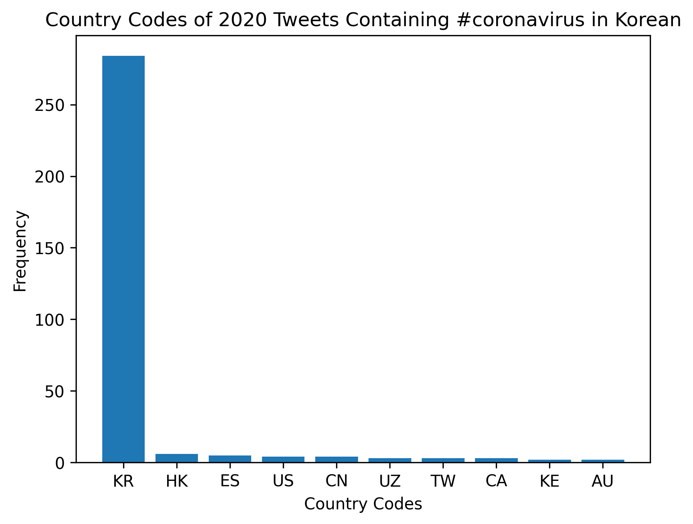
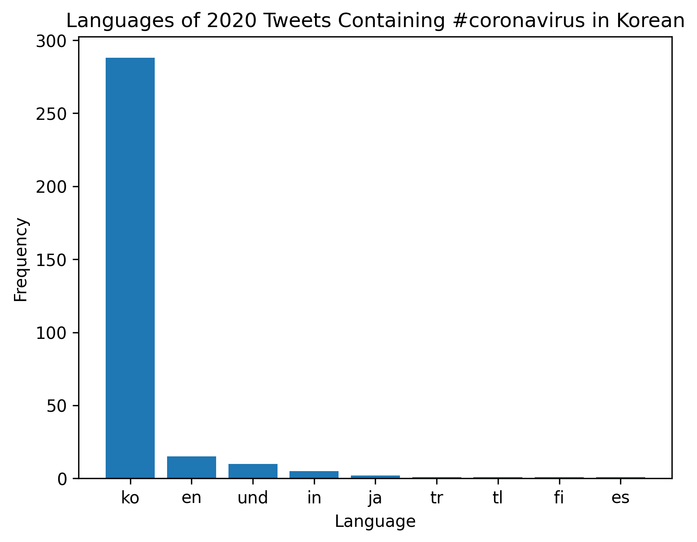
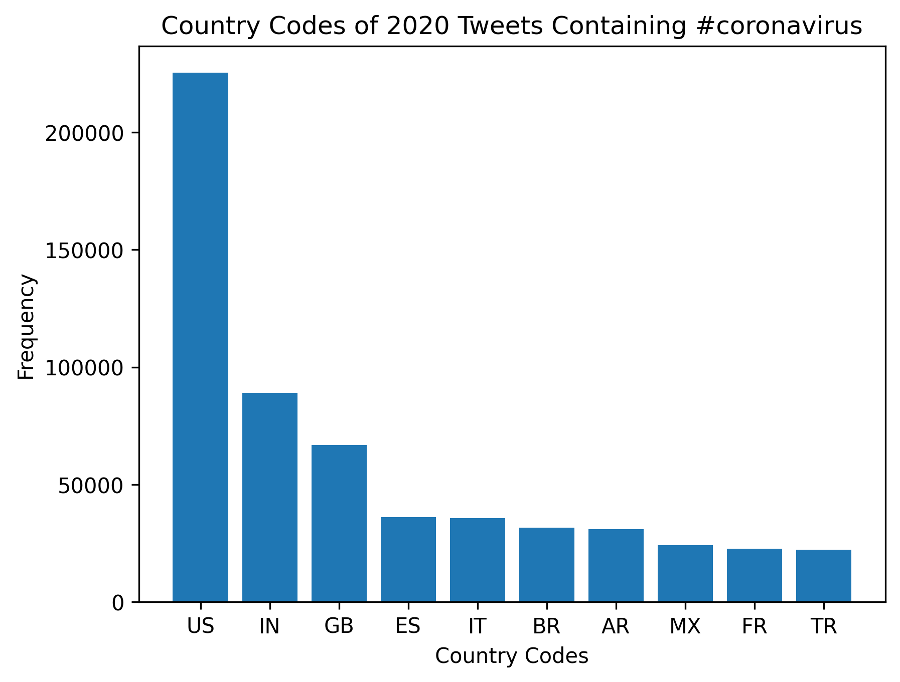
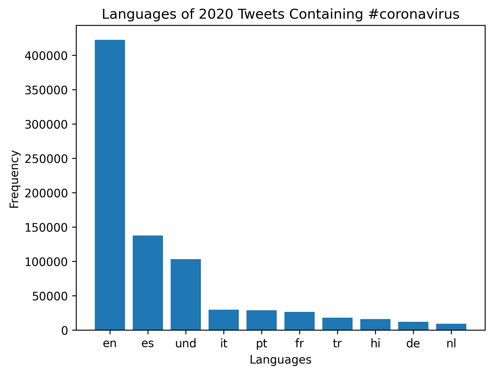
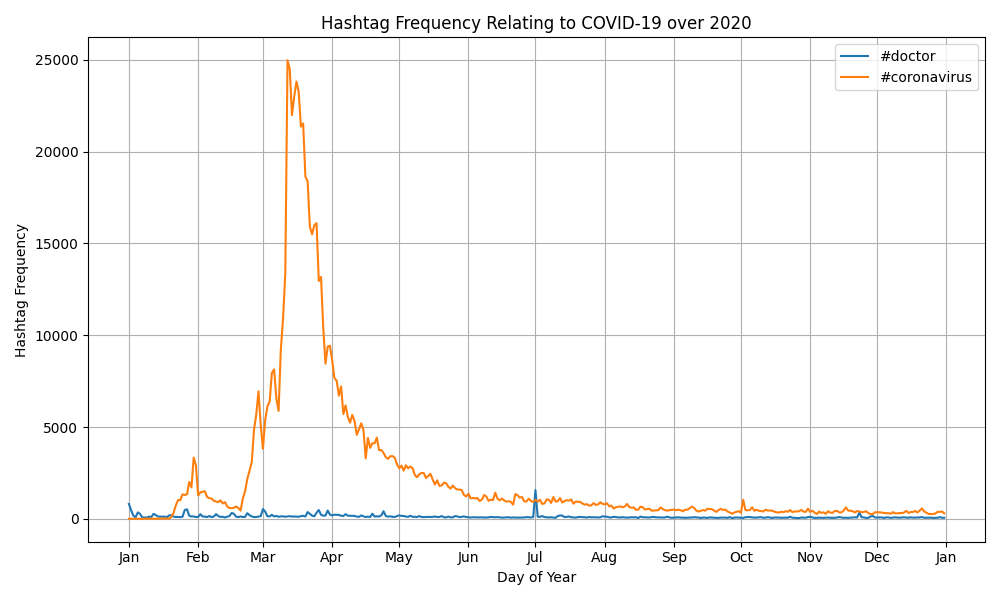

# Coronavirus twitter analysis

This project looked to analyze the use of hashtags related to the COVID-19 pandemic in tweets during the year 2020. Multiple python scripts were used to compile the compressed data from Twitter, filtering for the year 2020, then counting the number of times a tweet used a certain hashtag. For each related hashtag the number of times it was posted in a specific language or from a certain country was also determined. The output was compiled into two files one showing the total number of times hashtags were used in certain languages during 2020 and the other showing these values for different countries. Four plots showcasing these results for #coronavirus in both english and korean are pictured below. 

Another python script was used to compile the total counts for specific hashtags each day throughout 2020. The plot below shows the output of this script when looking at tweets referencing #doctor or #coronavirus. 

